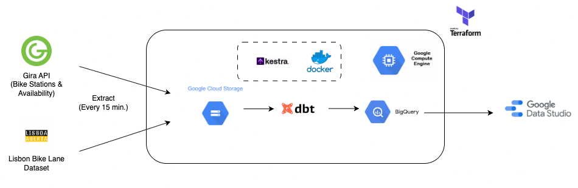

# lisbon-bike-usage
This project analyzes the usage patterns of Lisbon's Gira bike-sharing system using public data. Technologies: Python, Kestra, dbt, Terraform , Looker Data Studio

 
 
 

📌 Problem Statement & Project Description
 
 
 
Urban mobility is a key factor in developing sustainable, livable cities. Lisbon has made major investments in bike-sharing infrastructure through the Gira system and expanded its network of dedicated bike lanes. However, understanding how, when, and where citizens use these services remains a challenge.

This project — Lisbon bike usage — aims to analyze real-time and historical data from the Gira bike-sharing API to answer key questions such as:

  - What are the peak hours of bike usage across the city?

  - How does bike availability vary by neighborhood or station?

  - Are Gira stations effectively supported by nearby bike lanes?

  - Do usage patterns differ between weekdays and weekends or during working vs. non-working hours?

Using a modern data stack (dbt, BigQuery, Kestra, Terraform), the project builds an automated data pipelines that collects, transforms, and analyzes bike availability real time data every 15 minutes. It models trends over time, enabling visualization and decision-making for urban planners, policy makers, and curious citizens.

 
 
 

🧰 Technologies, Tools & Data Sources Used

🚲 Data Sources
  - Gira API: Real-time public API providing real-time station-level bike availability.

  - Openstreetmap API: editing API for fetching and saving raw geodata from/to the OpenStreetMap database

  - Lisbon Open Data: Dataset with official bike lane infrastructure, including length and location of each segment.

   

🛠️ Tools & Technologies
  - Kestra:	Workflow orchestration to schedule and execute data collection tasks.
  - dbt Core: SQL-based transformation framework used to model and document the data.
  - Terraform: Infrastructure-as-code to provision and manage GCP resources.
  - Docker:	Containerized environments to ensure portability and automation.
  - Google Data Studio:	Used to explore and visualize usage patterns and trends.
  - Google Cloud Platform (GCP)
        - Google Cloud Storage (GCS) - Data Lake.
        - Big Query (BQ DWH) - Data warehouse.
  
 
 
 

📊 Pipeline Diagram
  
  

 
 
 

🔄 Pipeline Explanation

The pipeline is primarily orchestrated using Kestra, running inside Docker containers to ensure consistent, reproducible environments. The Docker image uses a lightweight Python 3.9 base image. For details on dependencies and environment setup, refer to the Dockercompose file and requirements.txt.

Kestra manages the orchestration and scheduling of pipeline tasks, such as calling the Gira API, loading data into Google Cloud Storage (GCS), and triggering BigQuery loading and dbt transformations.

Terraform is used to provision and manage the Google Cloud Platform (GCP) resources including:

  - Google Cloud Storage (GCS) buckets for raw data storage,

  - BigQuery as the data warehouse,

  - Additional resources as needed.

Relevant Terraform variables are stored in variables.tf, and infrastructure definitions are in main.tf. Given the relatively small data size, resource configurations are optimized for cost-efficiency.

Main Pipeline Components and Functions
  Data Ingestion:
  - gira-realtime-fetch: Fetches real-time Gira station status data every 15 minutes and stores the resulting CSV in a Google Cloud Storage (GCS) bucket.
    Key Tasks:
      - fetch_gira_data: A Python script that queries the CityBikes Gira API, processes station-level bike availability data, and saves it as a CSV file with a timestamp.
      - upload_to_gcs: Uploads the generated CSV file to a partitioned path in GCS (organized by year, month, day, and hour).
      - purge_temp_files: Cleans up temporary files after execution to avoid unnecessary storage usage.

  - gira-station-location: Uses the OpenStreetMap reverse geocoding API to enrich each Gira station with location metadata (like suburb, neighbourhood, city district, and village), and stores the resulting data in BigQuery.
    Key Tasks:
      - run_python_script: Fetches all Gira station locations from the CityBikes API, reverse-geocodes each using OpenStreetMap’s Nominatim API, and stores the results in a CSV file.
      - upload_to_gcs: Uploads the CSV to GCS with a filename that includes the current date.
      - load_to_bigquery: Loads the enriched location data from GCS into a BigQuery table (bike_project.gira_station_locations) using CSV autodetect.
      - purge_files: Cleans up temporary files after execution to avoid unnecessary storage usage.

  - upload-bikelanes-file-to-bigquery: Manually uploads a CSV file containing bike lane data into the BigQuery table bike_project.bike_lanes_data (ciclovias_lisboa.csv).

  Data Loading:
  - gira-daily-csv-to-bq: Loads Gira station data collected throughout the current day into BigQuery at 23:55 Lisbon time. The table is partitioned by hour based on the timestamp field.
    Key Tasks: 
        - load_to_bigquery: Load all CSVs from the current day's GCS folder into the bike_project.bike_data_row BigQuery table with hourly time partitioning.

  Data Transforming:
  - stg_bike_stations: A cleaned view of bike station locations, enriched with the best-available administrative label for geographic grouping.
  - stg_bike_lanes: A structured view of Lisbon’s bike lane network, ready for further analysis by type, segregation level, and village-level aggregation.
  - stg_bike_lanes_by_village: A summarized view that enables spatial analysis of bike lane distribution across villages in Lisbon.
  - mart_station_infra_coverage: Combines bike station and bike lane data to create a village-level fact table showing key infrastructure metrics.
  - inc_bike_station_utilization_incremental: Aggregates bike station usage metrics over fixed 4-hour intervals, tracking availability of bikes and slots per station.
  - mart_peak_hours_analysis: Analyzes hourly patterns of bike usage per station by calculating changes in average free bikes over 4-hour time intervals and aggregating them across time dimensions.

 
 
 

🚀 Step-by-Step Replication Guide

Setup google cloud
  - Create a google cloud account
  - Setup a new google cloud project.
  - Create a new service account. Give the service account the Compute Admin, Service Account User, Storage Admin, Storage Object Admin, and BigQuery Admin Roles.
  - After the service account has been created, click on Manage Keys under the Actions Menu. Click on the Add Key dropdown and click on Create new key. A prompt should pop up asking to download it as a json or P12 file. Choose the json format and click Create. Save your key file.
  - Install the the Google Cloud CLI (https://cloud.google.com/sdk/docs/install-sdk). Assuming you have an Ubuntu linux distro or similar as your environment, follow the directions for Debian/Ubuntu. Make sure you log in by running gcloud init. Choose the cloud project you created to use.
  - Set the environment variable to point to your downloaded service account keys json file:
  export GOOGLE_APPLICATION_CREDENTIALS=<path/to/your/service-account-authkeys>.json
   - Refresh token/session, and verify authentication gcloud auth application-default login

Setup VM enviroment
  - Generate SSH keys to connect to VM (https://cloud.google.com/compute/docs/connect/create-ssh-keys)
   1) cd .
   2) mkdir .ssh 
   3) ssh-keygen -t rsa -f ~/.ssh/KEY_FILENAME -C USERNAME
   4) use the public generated key to associate as a new ssh in GCP
  - Compute Engine -> VM Instantnces -> Create new instance (Debian/Ubuntu OS)
  - Log in your newly created VM environment using the following command ssh -i /path/to/private/ssh/key username@vm_external_ip_address. 

Setup enviroment
  - python3 -m venv dbt_env
  - source dbt_env/bin/activate
  - pip install -r requirements.txt
  - git clone https://github.com/your-username/lisbon-bike-usage.git
  - cd lisbon-bike-usage

Setup Terraform:
  - wget https://releases.hashicorp.com/terraform/1.8.2/terraform_1.8.2_linux_amd64.zip
  - unzip terraform_1.8.2_linux_amd64.zip
  - sudo mv terraform /usr/local/bin/ 
  - cd to the terraform directory, fulfill the variables file and enter the commands terraform init, terraform plan, and terraform apply. You can remove the corresponding infrastructure by using terraform destroy.

Setup Kestra:
  - Install docker compose: 
    1) sudo curl -L "https://github.com/docker/compose/releases/latest/download/docker-compose-$(uname -s)-$(uname -m)" -o /usr/local/bin/docker-compose
    2) sudo chmod +x /usr/local/bin/docker-compose
    3) cd docker
    4) set all your docker credentials in .env_example and change the name of the file to .env
    4) docker-compose up -d
    5) use port (http://localhost:8080/) to enter in kestra
    6) Inside kestra define you KV keys 
    

Setup dbt core
  - create ~/.dbt/profiles.yml with the appropriate connection info (profiles_example.yml)
  - cd to dbt_core folder
  - dbt deeps
  - dbt debug
  - dbt run

